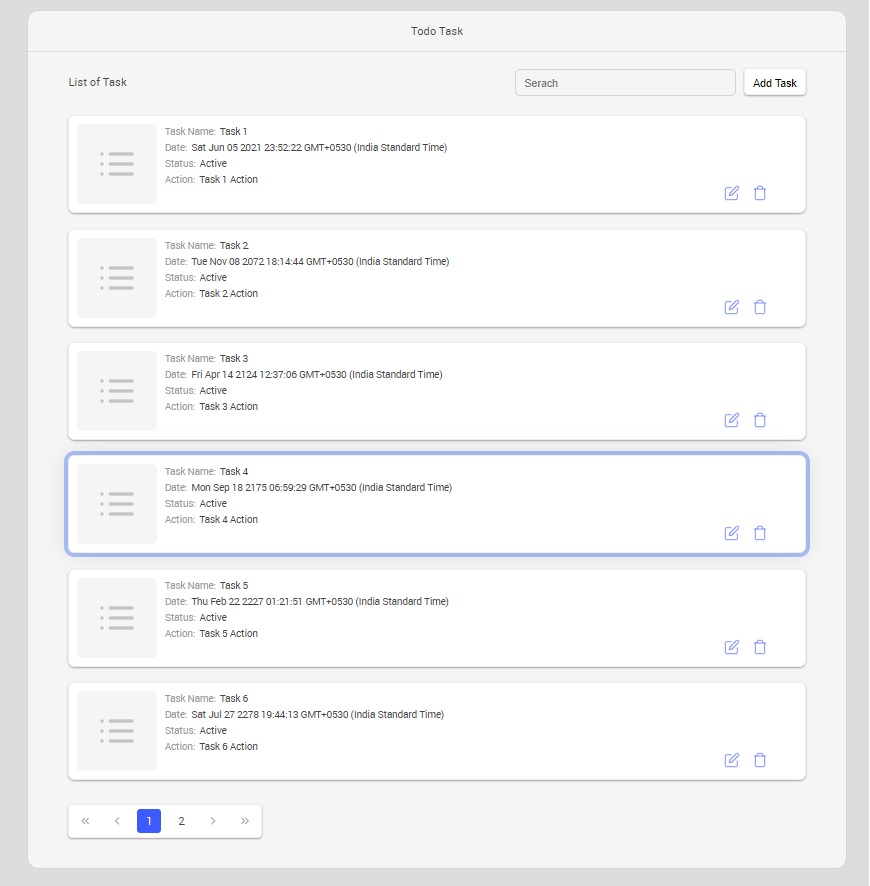
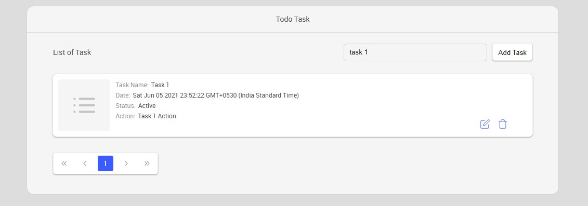
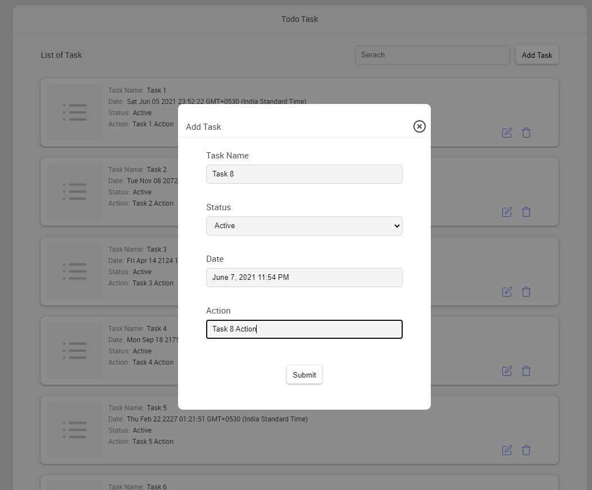
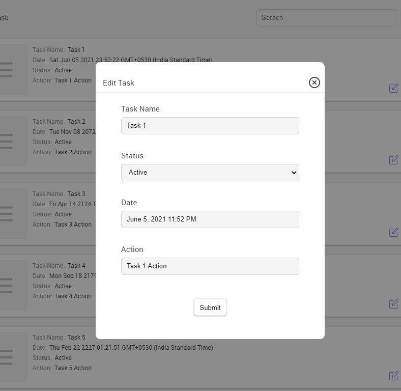

# TODO-TASK-Ui
### Used library and plugins

1. React.js
2. Scss / Css
3. Redux
4. Typescript / Javascript
5. Webpack

### How to build code

1. its required latest node and npm installed on local machine. this build work on any OS which support node and npm.
2. install dependency by using command `npm install` in root folder.
3. for build use `npm build`.

### How to run
1. to run type command `npm start`.
2. use url to view UI in browser http://localhost:3000

### Screenshots

